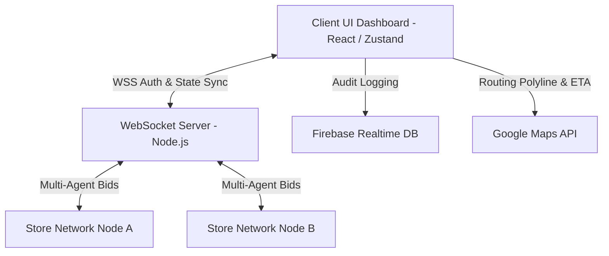

# NeuroCommerce

## 1. Project Overview

NeuroCommerce is a full-stack AI-powered retail intelligence system designed to act as a self-healing inventory assistant for multi-store retail management. It operates on a decentralized, agent-based architecture where individual store nodes evaluate local stock levels and demand spikes using local AI rule engines and negotiate surplus transfers autonomously. 

The system mitigates supply chain risks without relying on expensive, slow, or externally hosted Large Language Models (LLMs). Through real-time WebSocket communication, embedded risk analysis (Threat Engine), and recursive variance tracking (Bullwhip Effect Detector), NeuroCommerce serves as a highly robust, secure, and reactive logistics coordination platform.

## 2. Architecture Diagram



## 3. Step-by-step Setup

### a. Clone the Repository
Open your terminal and pull the project. Ensure you have Node.js v18+ installed.

### b. How to get Firebase API keys
1. Go to the [Firebase Console](https://console.firebase.google.com/).
2. Click **Create a project** and follow the prompts.
3. In your new project, click the **Web** icon (`</>`) to add a web app.
4. Name your app, and Firebase will generate a configuration object holding your `apiKey`, `authDomain`, `databaseURL`, `projectId`, and `appId`.

### c. How to get Google Maps API key
1. Go to the [Google Cloud Console](https://console.cloud.google.com/).
2. Create a new project and navigate to **APIs & Services > Credentials**.
3. Click **Create Credentials** -> **API Key**.
4. Remember to enable the **Maps JavaScript API** and **Distance Matrix API** via the library dashboard for that project.

### d. Environment Configuration
Copy the `.env.example` file and configure it:
```bash
cp .env.example .env
```
Open `.env` and fill in the keys you generated above.

### e. Run Development Servers
NeuroCommerce uses a root-level concurrently script to launch both client and server effortlessly.
```bash
npm install
npm run dev
```
Navigate to `http://localhost:5173`.

## 4. Feature List
- **Local AI Decision Engine**: Rule-based transfer algorithms that intelligently determine surplus redistribution.
- **Threat Engine (KYA - Know Your Agent)**: Heuristic scoring identifying velocity anomalies, pattern irregularities, and request spoofing to quarantine compromised nodes.
- **Bullwhip Effect Detector**: Monitors cascading demand variance to prevent unnecessary network-wide stockouts.
- **Multi-Agent Inventory Negotiation**: A secure WebSocket auction system where stores bid to fulfill network requests.
- **Tamper-Evident Audit Trail**: All decisions and manual overrides are cryptographicically signed (HMAC-SHA256) and appended to a Firebase ledger.
- **Dynamic Distance Matrix Integration**: Automatically calculates route distance penalties when evaluating transfer efficiency.

## 5. Simulation Guide

Use the top-bar controls to trigger system scenarios:
- **Normal Flow**: Standard micro-fluctuations in localized metrics. 
- **Viral Spike**: Synthesizes a massive 5x demand surge on "Watches" at Store A to trigger immediate transfer networks.
- **Fake Demand Attack**: Simulates a bot-style burst request at Store D, instantly lowering its authenticity score and dropping it from network capabilities.
- **Demo Mode**: A guided playback mode highlighting each step in the simulation.

## 6. Security Design
- **HMAC Signatures**: Every message broadcast to the WebSocket server is stamped with an HMAC-SHA256 signature combining the `storeId`, `timestamp`, and `payloadStr`, verified immediately by the `securityMiddleware.ts`.
- **Node Quarantine**: Any nodes generating 3 consecutive invalid signatures are structurally isolated from the negotiation pool.
- **No-Trust AI Policy**: Client dashboard acts as a central observer but holds absolute override power over anomalous automated transfers.
